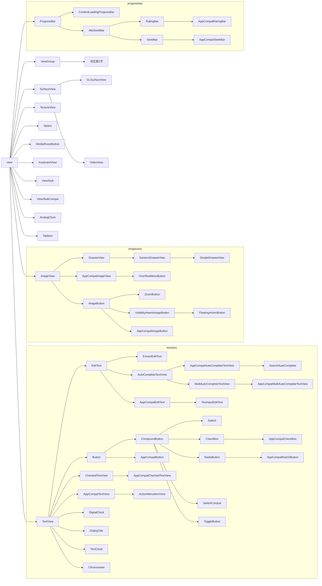

[Android View的继承体系大全（包含125个view的所有子类）](https://blog.csdn.net/lsyz0021/article/details/53144273)


以下介绍`View`家族树(继承树)

??? tip "`类继承树`并不体现类的`包路径`(物理位置)"
	而官方给出的参考文档是基于`包路径`的
	
	因此，官方的API适合参考查询，不适合从继承角度学习

###  ###

# 1.view #

!!! note
	`View`“最重”的结点是`ViewGroup`，放到第二节讲




# 2.**GroupView** #

!!! note
	- 六大布局`LinearLayout`，`RelativeLayout`，`TableLayout`，`FrameLayout`，`GridLayout`，`AbsoluteLayout`均是`GroupView`的子孙
	- 其中`TableLayout`是`LinearLayout`的儿子


```mermaid
graph LR

ViewGroup --> LinearLayoutCompat
	LinearLayoutCompat --> ActionMenuView
	LinearLayoutCompat --> InnerLayout
	LinearLayoutCompat --> ForegroundLinearLayout --> NavigationMenuItemView
	LinearLayoutCompat --> SearchView
	LinearLayoutCompat --> TabVrew
ViewGroup --> ActivityChooserView
ViewGroup --> CoordinatorLayout
ViewGroup --> LinearLayout
subgraph linearlayout
	LinearLayout --> AppBarLayout
	LinearLayout --> ButtonBa1Layout
	LinearLayout --> ZoomControls
	LinearLayout --> SearchV1ew --> 1["MySearchView(在searchViewCompatIcs内部)"]
	LinearLayout --> {==TableLayout==}
	LinearLayout --> 2["SlidingTabStrip(在TableLayout内部)"]
	LinearLayout --> 3["TabView(在TableLayout内部)"]
	LinearLayout --> RadioGroup
	LinearLayout --> FitWindowsLinearLayout
	LinearLayout --> TextlnputLayout
	LinearLayout --> ActionMenuView
	LinearLayout --> SnackbarLayout
	LinearLayout --> TableRow
	LinearLayout --> ListMenuItemView
	LinearLayout --> TabWidget
	LinearLayout --> NumberPicker
end
ViewGroup --> PagerTitleStrip --> PagerTabStnp
ViewGroup --> FragmentBreadCrumbs
ViewGroup --> FrameLayout
subgraph framelayout
	FrameLayout --> CalendarView
	FrameLayout --> FitWindowsFrameLayout
	FrameLayout --> CollapsingToolbarLayout
	FrameLayout --> 4["CollapsibleActionViewWrapper(在MenuItemWrapperICS内部)"]
	FrameLayout --> MediaController
	FrameLayout --> TabHost --> FragmentTabHost
	FrameLayout --> GestureOverlayView
	FrameLayout --> DatePicker
	FrameLayout --> ScrimInsetsFrameLayout --> NavigationView
	FrameLayout --> HonzontalScrollView
		HonzontalScrollView --> TabLayout
		HonzontalScrollView --> ScrollingTabContainerView
	FrameLayout --> ActionBarContainer
	FrameLayout --> ScrollView
	FrameLayout --> AppWidgetHostView
	FrameLayout --> ViewAnimator
		ViewAnimator --> ViewSwitcher
			ViewSwitcher --> Textswitcher
			ViewSwitcher --> ImageSwitcher
		ViewAnimator --> ViewFlipper
	FrameLayout --> TimePicker
	FrameLayout --> NestedScrollView
	FrameLayout --> ContentFrameLayout --> 5["ListMenuDecorView(在AppCompatDelegateImplV7内部)"]
	FrameLayout --> NoSaveStateFrameLayout
end
ViewGroup --> ViewPager
ViewGroup --> RecyclerView --> NavigationMenuView
ViewGroup --> Toolbar
ViewGroup --> AbsoluteLayout --> WebView
subgraph absolutelayout
	AbsoluteLayout
	WebView
end
ViewGroup --> RelativeLayout
subgraph relativelayout
	RelativeLayout --> TwoLineListItem
	RelativeLayout --> DialerFilter
end
ViewGroup --> SlidingDrawer
ViewGroup --> AdapterView
	AdapterView --> AdapterViewAnimator
		AdapterViewAnimator --> StackView
		AdapterViewAnimator --> AdapterViewFlipper
	AdapterView --> AbsSpinner
		AbsSpinner --> Gallery
		AbsSpinner --> spinner
	AdapterView --> AbsListView
		AbsListView --> GridView
		AbsListView --> ListView
			ListView --> ExpandedMenuView
			ListView --> ListViewCompat --> 6["DropDownListView(在ListPopupWindow内部)"]
			ListView --> ExpandableListView
ViewGroup --> AbsActionBarView --> ActionBarContextView
ViewGroup --> DrawerLayout
ViewGroup --> TvView
ViewGroup --> ActionBarOverlayLayout
ViewGroup --> SwipeRefreshLayout
ViewGroup --> SlidingPaneLayout
ViewGroup --> GridLayout
subgraph gridlayout
	GridLayout
end
```